# Data Science Nigeria Staff Promotion Algorithm

This is the capstone project Udacity Machine Learning with Microsoft Azure Nanodegree. In this project, we built a machine learning model to Predicting staff that are likely to be promoted based on defined personal and performance parameters. We built the model using HyperDrive Config and AUtoML run, and deployed the model as a service.

## Project Set Up and Installation
To set up this project in AzureML, kindly ensure the following are checked:

* Download the dataset used to train the model from <a href='https://www.kaggle.com/c/intercampusai2019'>kaggle </a> and register as a dataset in Azure ML studio under the name 'train-data'
* Download all .ipynb and .py files - note that the <a href='https://github.com/Opiano1/nd00333-capstone/blob/master/starter_file/hyperparameter_tuning.ipynb'> notebook</a> uses <a href='https://github.com/Opiano1/nd00333-capstone/blob/master/starter_file/train.py'>python file </a> as an entry script while <a href='https://github.com/Opiano1/nd00333-capstone/blob/master/starter_file/automl.ipynb'>AutoML.ipynb</a> uses <a href='https://github.com/Opiano1/nd00333-capstone/blob/master/starter_file/score.py'>score.py</a> as a scoring script.

## Project Workflow
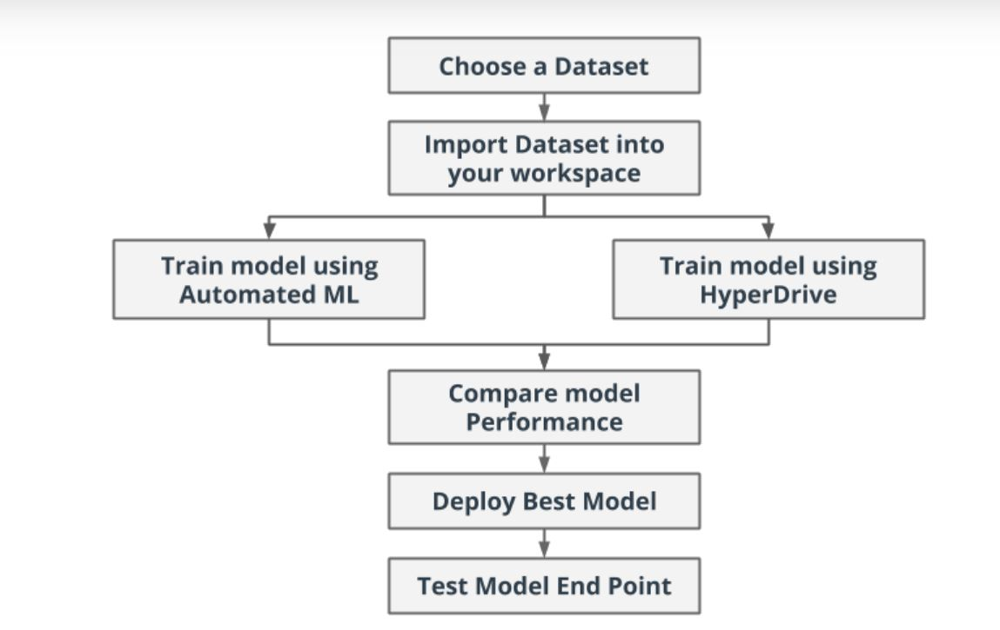

## Dataset

### Overview
The data used in this project is an external dataset not hosted on the Azure ecosystem: This is an employee information of an organization in Nigeria.

The data is to help to study the pattern of promotion. With this insight, the stakeholders can understand the important features among available features that can be used to predict promotion eligibility

### Task
The dataset has a binary feature 'Promoted_Or_Not' consisting of only two entries: 0 describing a employees not promoted and 1 implying employees promoted; hence, a classification problem.

### Features and definition
The dataset contains these variables as explained below:

• `EmployeeNo` : System-generated unique staff ID

• `Division`: Operational department where each employee works

• `Qualification`: Highest qualification received by the staff

• `Gender`: Male or Female

• `ChannelofRecruitment`: How the staff was recruited – this is via internal process, use of an agent or special referral

• `Trainings_Attended` : Unique paid and unpaid trainings attended by each staff in the previous business cycle

• `Yearofbirth`: Year that the employee was born

• `LastPerformanceScore` Previous year overall performance HR score and rated on a scale of 0-14

• `Yearofrecruitment` : The year that each staff was recruited into the company

• `Targets_met`: A measure of employees who meet the annual set target. If met, the staff scores 1 but if not, it is a 0.

• `Previous_Award` : An indicator of previous award won. If yes, it is a 1 and if No it is a 0.

• `Trainingscoreaverage`: Feedback score on training attended based on evaluation

• `StateOfOrigin`: The state that the employee claims

• `Foreign_schooled`: An indicator of staff who had any of their post-secondary education outside the country. Responses are in Yes or No

• `Marital_Status`: Marriage status of employees and recorded as Yes or No

• `PastDisciplinaryAction` : An indicator if a staff has been summoned to a disciplinary panel in the past. This is indicated as Yes or No

• `PreviousIntraDepartmentalMovement` : This is an indicator to identify staff who have moved between departments in the past. Yes and No are the responses.

• `Noofprevious_employers` : A list of the number of companies that an employee worked with before joining the organisation. This is recorded as counts

### Access
The dataset, in .csv format, is hosted on this gitub repository and can be accessed from this link:

https://raw.githubusercontent.com/Opiano1/nd00333-capstone/master/starter_file/data/train.csv

A tabular dataset must be represented correctly before use in Azure ML Studio.

TabularDataset is created using methods like azureml.data.dataset_factory.TabularDatasetFactory.from_delimited_files from the TabularDatasetFactory class as shown below:

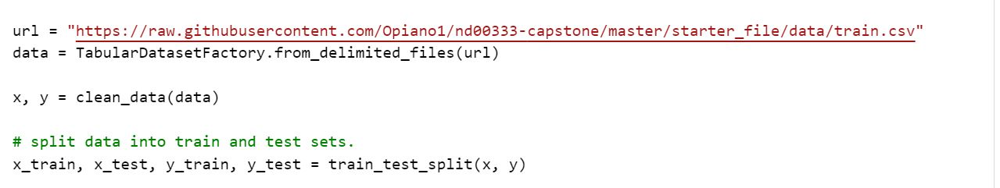

## Automated ML
The AutoMl setting contains parameters as explained below, and the value I choose for each parameter.

 `Featurization` = auto - FeaturizationConfig Indicator for whether featurization step should be done automatically or not, or whether customized featurization should be used.

`n_cross_validations` = 4 - How many cross validations to perform when user validation data is not specified.

`experiment_timeout_minutes` = 30 - Maximum amount of time in hours that all iterations combined can take before the experiment terminates.

`enable_early_stopping` = True - Whether to enable early termination if the score is not improving in the short term. The default is False.

`verbosity = logging.INFO` - The verbosity level for writing to the log file.

## AutoML Config Details
Just like the above for AutoML setting, find below the details for the AutoML Config.

`experiment_timeout_minutes` = 30 - Maximum amount of time in hours that all iterations combined can take before the experiment terminates.

`task` = classification - This is the type of task to be run, in this case, it is a classification task. The model predicts whether a particular user will default on the loan.

`primary_metric` = accuracy - This is the metric that the AutoML will optimize for model selection. For this classfication task, accuracy was used.

`training_data` = df_train - This is the training dataset which is a dataframe of the pre-processed data set. It will be used within the experiment, so it contains both the training features and a label column.

`label_column_name` = "Promoted_or_Not" - This is the name of the label column, and it indicates the Loan Status, whether the applicant defaulted on the loan or not.

n_cross_validations = 5 - This is the number of cross validations to perform when user validation data is not specified.

### Results
The completed automl experiment is shown below. The best model is the `VotingEnsemble` model with an accuracy of `94.199%` as seen on top of the list:

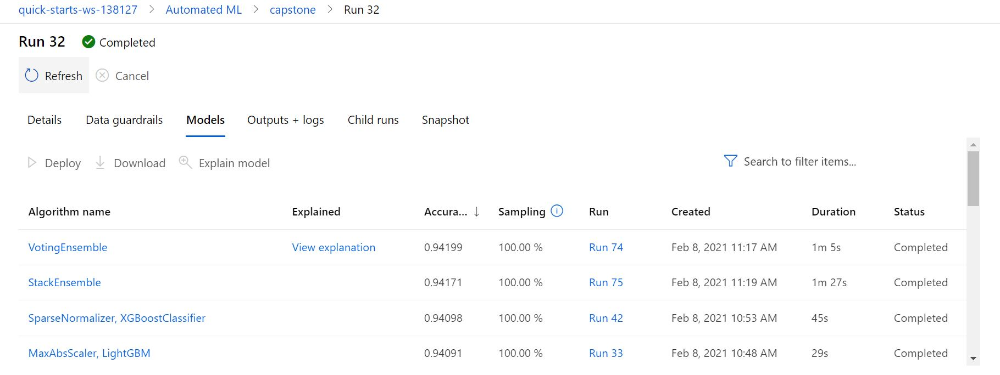

Various metrics of the best model is seen below:
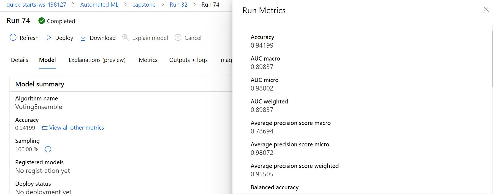

### Other Results
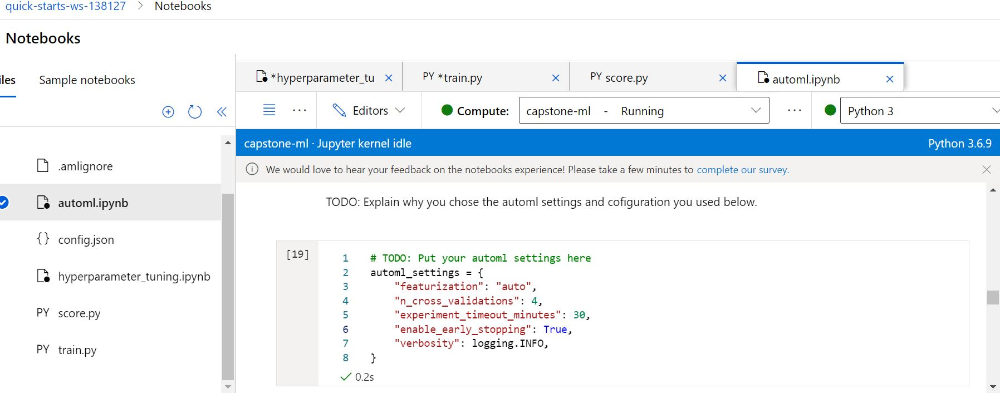

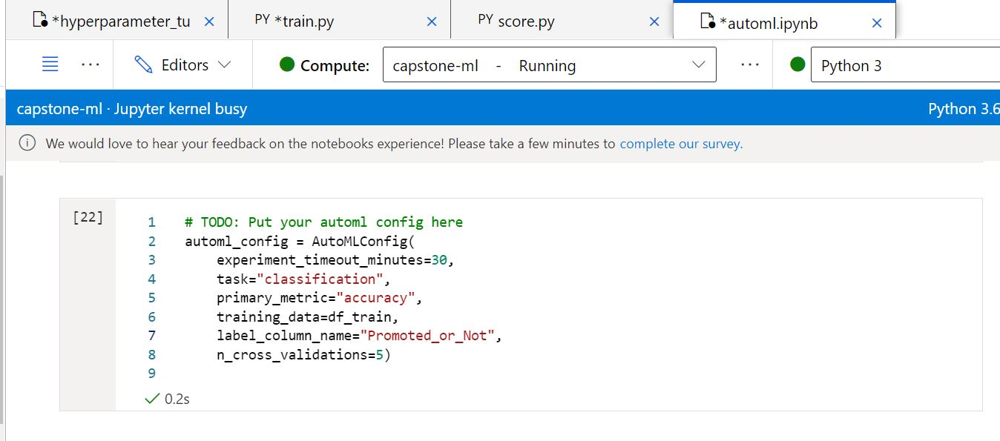

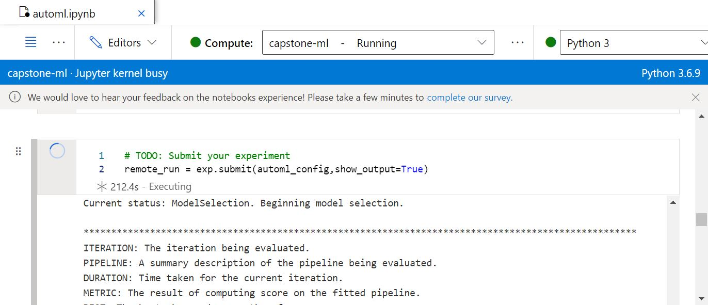

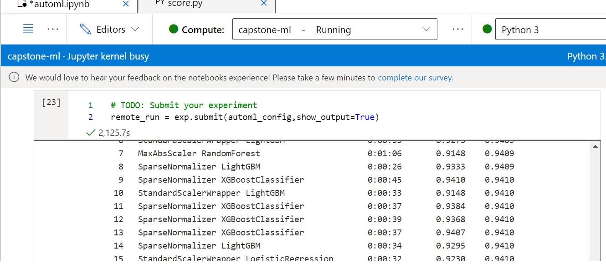

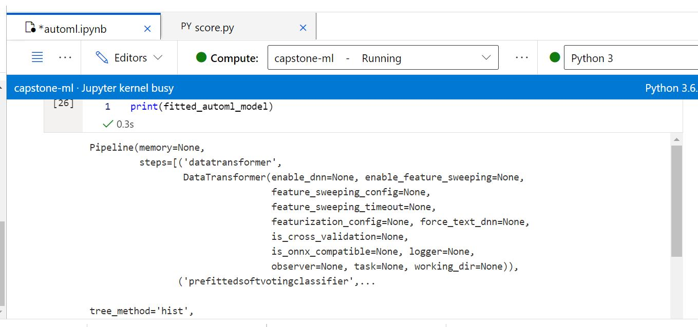

### Best model and runID
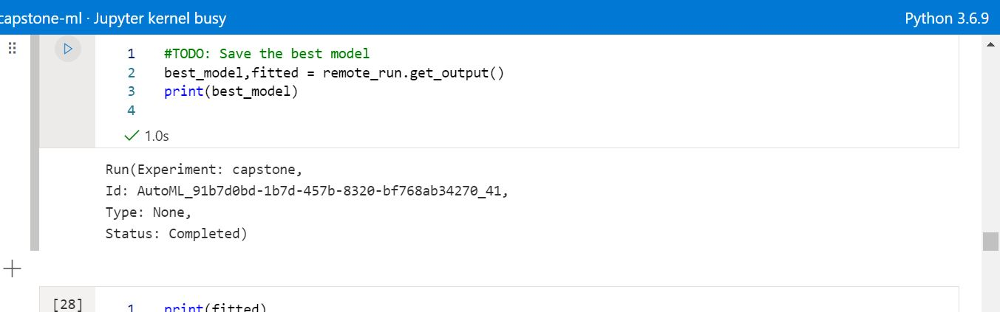

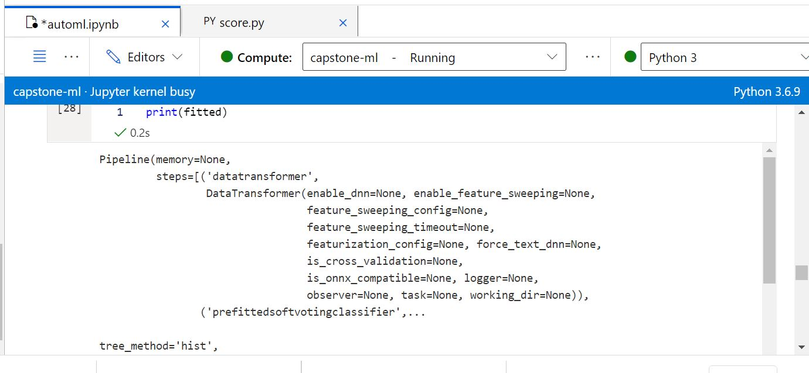

### Best estimator from best model
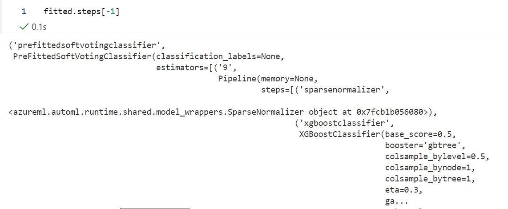

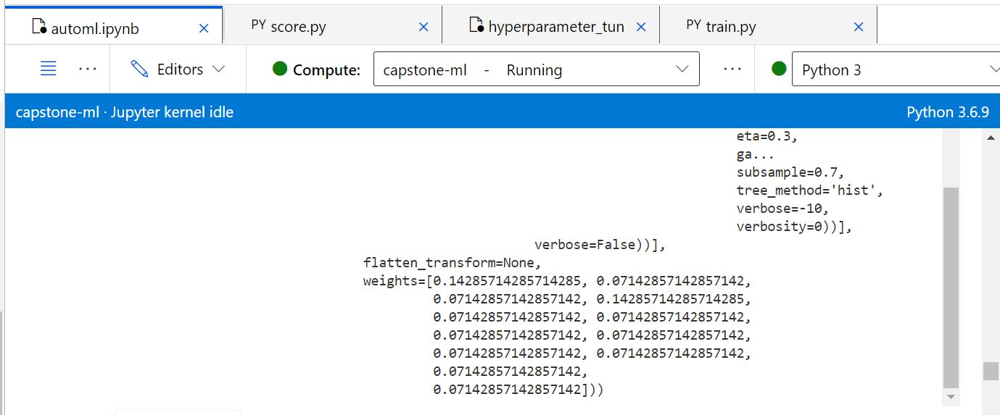

### RunWidget

### Best Model already registered with it's RunID & other Metrics
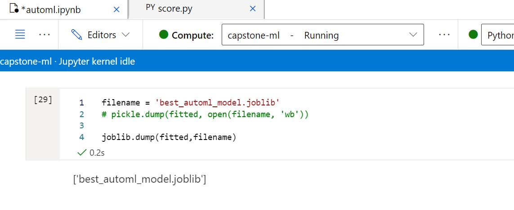

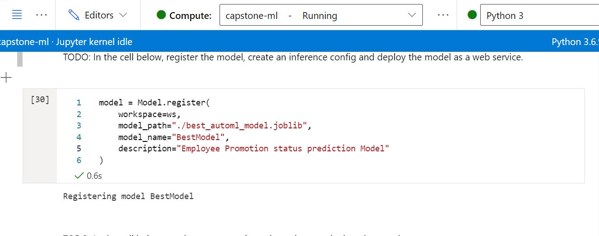

### Suggestions for possible improvement
* Increase experiment timeout duration. This would allow for more model experimentation, but at expense of cost.
* Try a different primary metric. Sometimes accuracy alone doesn't represent true picture of the model's performance. Recall or precision are more specific metrics in related classification problems.
* Tweak some other AutoML confirguration parameters including number of cross validation to reduce model bias.
* Feature Engineering - Engineer new features which may be helpful in improving the model

## Hyperparameter Tuning
Given that the problem is a classification Supervised learning task, this inspired using the baseline Logistic Regression model to train the algorithm. 

### Overview of the hyperparameters used
Hyperparameters are adjustable parameters that let you control the model training process. Hyperparameter tuning is the process of finding the configuration of hyperparameters that results in the best performance. The process is typically computationally expensive and manual.

The two hyperparamters used in this experiment are C and max_iter. C is the Inverse Regularization Strength which applies a penalty to stop increasing the magnitude of parameter values in order to reduce overfitting. max_iter is the maximum iteration to converge for the SKLearn Logistic Regression algorithm.

The hyperparameter search range used for `C` is `[1, 2, 3, 4, 5, 6]` and for `max_iter` is `[50, 100, 150, 200, 250, 300]`.

### Results
The Hyperdrive run and outputs are shown below;

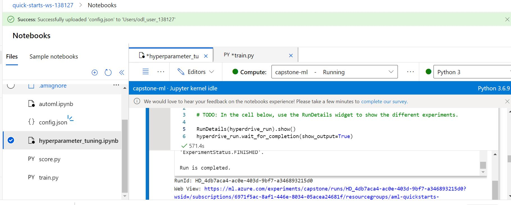

##### RunDetails widget showing progress of training runs from experiments
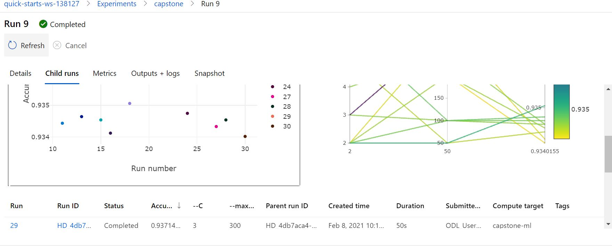

#### Best Hyperdrive model trained with its hyperparameter settings
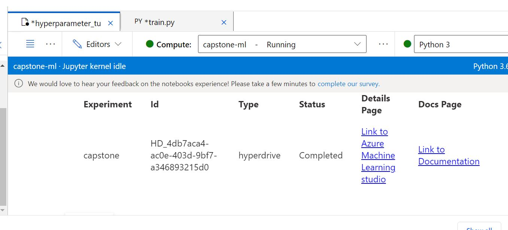

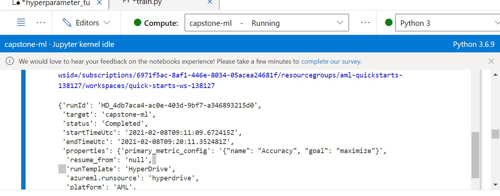

### Metrics
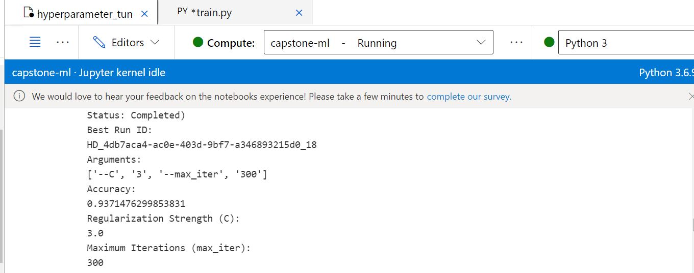

As seen above the Hyperdrive model had an accuracy of `93.7%`

### Suggestions for possible improvement
* Performing more Data Preprocessing from the `clean data function`: 
* Parameter sampling can be carried out more effectively. Increase in RandomParameterSampling or start with a wide range of values for each parameter, then refine the search space.
* Try other algorithms like Ensemble - Gradient Boosting, Catboost etc.
* Apply other types of parameter sampling including the Bayesian Parameter Sampling. Bayesian sampling tries to intelligently pick the next sample of hyperparameters, based on how the previous samples performed, such that the new sample improves the reported primary metric.
* Accuracy is not the only evaluation metric process, it would also be nice to explore some other statistical evaluation metrics.

## Model Deployment
The healthy endpoint is seen below ;
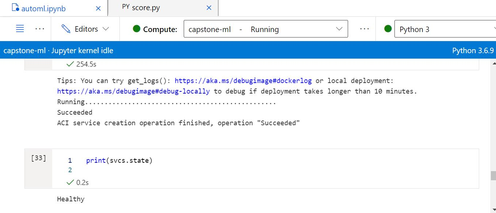

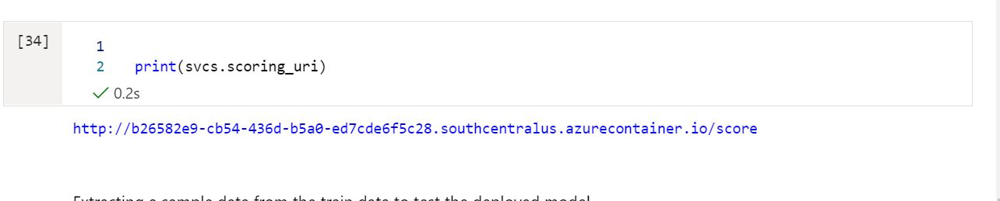

The deployed model is the best performer from AutoML - a VotingEnsemble regressor that has been registered - and as seen above, has an active endpoint at the specified scoring URI. To query the endpoint:

* sample test data

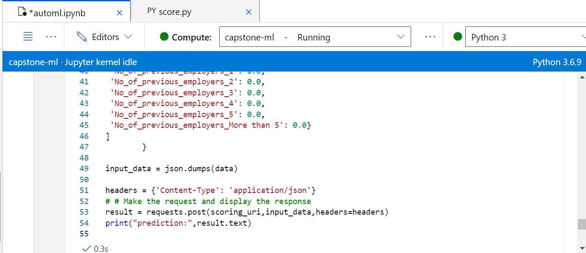

All the data parameters are adopted as a dictionary and converted to json for inputting to a scoring script. The cell is then run the code. This results in the scoring script 'score.py' runs the saved registered model and producing a response if the employee will be promoted or not as `1` or `0`
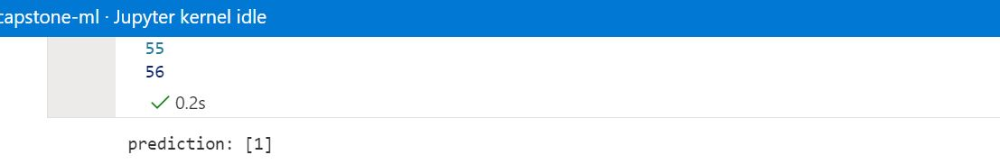

## Screen Recording
<a href='https://www.youtube.com/watch?v=V94ir1j47so'>Recordings</a>
